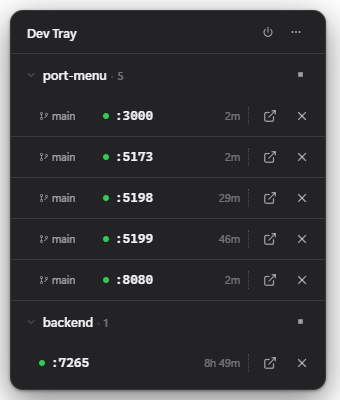

# Dev Tray

**localhost, organized.** A tiny Windows tray app that tracks your dev servers across projects.

[](#requirements)
[](https://www.electronjs.org/)
[](LICENSE)


Work across a few projects and you end up with a pile of `localhost` tabs and terminal windows.
Which port is 3001? Is that old server still running? Dev Tray sits in your system tray and scans
for local dev servers every few seconds. It shows which project each one belongs to, so you can open
or stop any of them without hunting for the right terminal.

<p align="center">
  
</p>

> **Status:** early alpha (`v0.1.0`), Windows-only. It works day to day, but expect rough edges and
> breaking changes. Issues and PRs welcome.

## What it does

- Finds listening dev servers on TCP ports 1024-49151 and rescans every few seconds.
- Groups them by project, the Git repo each server runs from, and shows the current branch.
- Shows a liveness dot per server. Green when the server answers, dimmed when the port is open but
  nothing responds.
- Opens a server in your browser or stops it in one click. Stopping kills the whole process tree,
  not just the parent.
- Copies the URL or port from a right-click menu.
- Shows a live count in the tray icon. Grey for none, green for running.
- Lets you set the refresh interval (2/5/10/30s) and launch at login.

## Using it

- **Open the popover.** Left-click the Dev Tray icon in your system tray.
- **Open or stop a server.** Each row has an ↗ button to open it in your browser and an ✕ button to
  stop it.
- **Copy or open.** Right-click a row for Copy URL, Copy Port, Open in Browser, and Kill Server.
- **Collapse a project.** Click a project heading to fold its servers away. The stop button beside the
  heading kills every server in that project at once.
- **Settings and quit.** The top-right `⋯` opens settings (refresh interval, launch at login). The
  power button quits Dev Tray.

## Privacy

Dev Tray runs entirely on your machine. No accounts, no sign-in, no telemetry, no external network
calls. The only connections it makes are health checks to `127.0.0.1`, your own computer, to see
which servers respond.

To name the project a server belongs to, Dev Tray reads that process's working directory from
Windows, the folder you started the server in, then looks for a nearby Git repository. Reading
another process's details this way is unusual for everyday apps, so antivirus tools sometimes flag
it. Here it only turns a port number into a project name, locally. Nothing leaves your device.

## Install

### Download (recommended)

Grab the latest Windows installer from the
[**Releases**](https://github.com/JohnC0de/dev-tray/releases/latest) page and run it. Dev Tray
launches straight into your system tray.

> No release published yet? Build it yourself with [Build a Windows installer](#build-a-windows-installer),
> or [run from source](#run-from-source).

### Uninstall

Dev Tray installs like any other Windows program. Remove it from **Settings > Apps > Installed apps**
(or Control Panel > Programs and Features). If you ran it from source, just delete the folder.

### Requirements

- Windows 10/11
- Node.js 18+ and npm (to run or build from source)
- PowerShell (Windows PowerShell 5.1 or PowerShell 7, both work)
- Git on `PATH` (optional, only needed to show branch names)

## Run from source

```powershell
npm install
npm start
```

### Native scanner (optional, Phase 6)

The Rust addon in `packages/scan-native` is not required for day-to-day dev yet (PowerShell worker
is still the default). To build it:

```powershell
# Rust stable + Visual Studio Build Tools (Desktop development with C++)
npm run build:native
```

Produces `packages/scan-native/scan-native.win32-x64-msvc.node`. Run `npm run test:native` for shape
tests and a live scan smoke check when the `.node` file is present.

The app launches into the system tray with no taskbar window. Click the tray icon to open the popover.

## Build a Windows installer

```powershell
npm run dist      # NSIS installer in dist/
npm run pack      # unpacked app in dist/win-unpacked/ (no installer)
```

`scan-worker.ps1` ships as an `extraResource` and resolves from `process.resourcesPath` in packaged
builds.

## Troubleshooting

- **`ENOENT ... path.txt` on `npm start`.** `npm install` finished but Electron's binary didn't
  download. Run `node node_modules/electron/install.js` once, or reinstall with network access.
- **No branch names shown.** Dev Tray needs `git` on your `PATH`. Servers still appear without it.
- **A server isn't detected.** Working-directory detection can't read elevated, 32-bit, or
  other-user processes. See [known limitations](docs/ARCHITECTURE.md#known-limitations).

## How it works

One resident PowerShell worker (`scan-worker.ps1`) answers a scan per poll. It lists listening ports,
maps them to PIDs, and reads each process's real working directory from its PEB. Keeping the worker
warm holds scans around 500 ms. Dev Tray then walks up to the nearest `.git` for the repo name and
branch, and drops anything that isn't a real dev server.

The full discovery pipeline, project-detection precedence, and limitations live in
[**docs/ARCHITECTURE.md**](docs/ARCHITECTURE.md). The reasoning behind each product decision lives in
the [ADRs](docs/adr/).

## Contributing

Contributions welcome. Open an issue or PR. Working conventions and notes for both humans and AI
agents live in [AGENTS.md](AGENTS.md). The product spec is in [docs/PRODUCT.md](docs/PRODUCT.md) and
the architecture in [docs/ARCHITECTURE.md](docs/ARCHITECTURE.md).

## License

[MIT](LICENSE)
